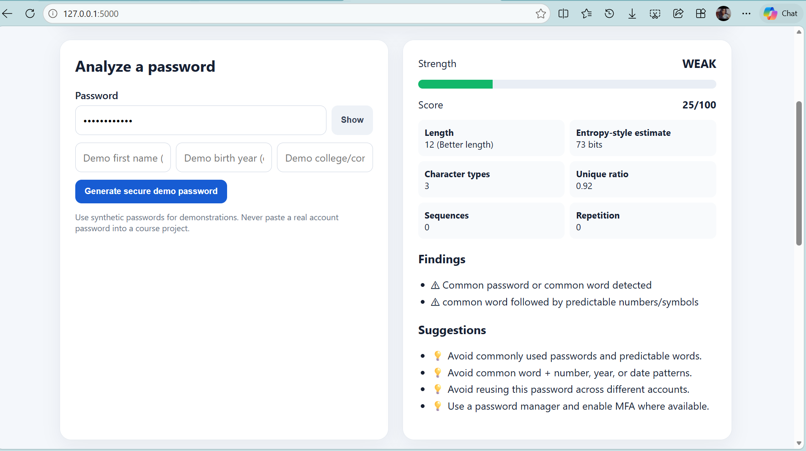
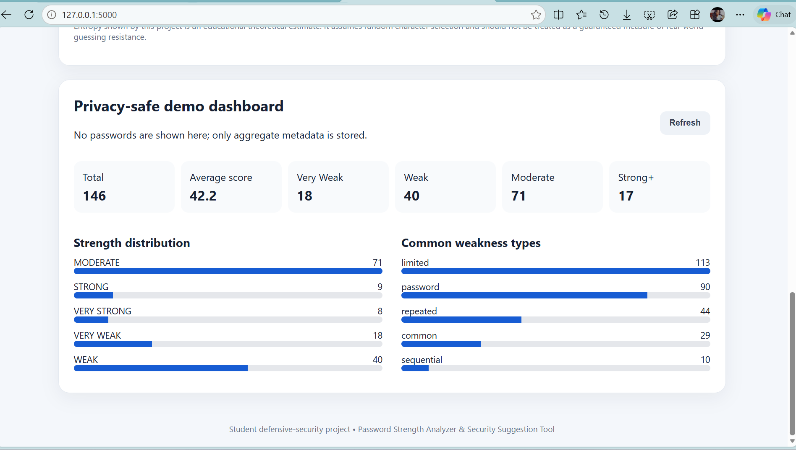

# 🔐 Password Strength Analyzer & Security Suggestion Tool

A beginner-friendly **defensive cybersecurity project** that analyzes password strength, identifies common security weaknesses, and provides actionable security recommendations.

The tool evaluates passwords using multiple signals including length, character diversity, common-password detection, sequences, keyboard patterns, repetition, predictable structures, optional personal-context overlap, and an educational entropy-style estimate.

> **Privacy-first design:** Passwords are analyzed transiently in application memory and are not stored in the analytics database.

---

## 📸 Screenshots

### Password Strength Analysis



### Privacy-Safe Analytics Dashboard



## ✨ Features

* 🔢 **0–100 password strength score**
* 📊 **Five strength classifications**

  * VERY WEAK
  * WEAK
  * MODERATE
  * STRONG
  * VERY STRONG
* 📏 Password length analysis
* 🔤 Character diversity analysis
* 📈 Unique-character ratio
* 🚫 Common-password detection
* 🔢 Sequential number/letter detection
* ⌨️ Keyboard-pattern detection
* 🔁 Repeated-character detection
* 🔄 Repeated-substring detection
* 📅 Predictable word + number/year detection
* 👤 Optional personal-context overlap detection
* 🧮 Educational entropy-style estimate
* 💡 Security recommendations
* 🔑 Secure password generator using Python `secrets`
* 📊 Privacy-safe SQLite analytics dashboard
* 🛡️ Password policy checker
* 🧪 Automated tests using pytest

---

## 🏗️ Architecture

```text
User
  │
  ▼
Web Interface
  │
  ▼
/api/analyze
  │
  ▼
In-Memory Password Analyzer
  │
  ├── Length Analysis
  ├── Character Diversity
  ├── Common Password Check
  ├── Pattern Detection
  ├── Repetition Detection
  ├── Policy Checks
  └── Entropy-Style Estimate
  │
  ▼
Scoring & Classification
  │
  ▼
Findings & Security Suggestions
  │
  ▼
Web Interface

Safe Derived Metadata
  │
  ▼
SQLite Analytics
  │
  ▼
Dashboard
```

**The submitted password itself does not enter analytics storage.**

---

## 🔒 Privacy & Security Design

The application follows a privacy-first approach:

* Passwords are analyzed transiently in application memory.
* Passwords are never inserted into SQLite.
* Passwords are not written to `localStorage` or `sessionStorage`.
* Passwords are not included in `/api/analyze` responses.
* Dashboard analytics contain only derived metadata.
* Demonstrations use synthetic passwords only.
* The application does not crack passwords or attempt credentials against external accounts.

### Stored analytics

The database stores safe metadata such as:

* Analysis ID
* Score
* Classification
* Password length
* Unique-character ratio
* Weakness count
* Timestamp
* Security finding metadata

There is intentionally **no password or password-hash column** in the analytics schema.

---

## 🧰 Technology Stack

| Technology | Purpose                |
| ---------- | ---------------------- |
| Python     | Backend logic          |
| Flask      | Web API                |
| HTML       | Interface              |
| CSS        | Styling                |
| JavaScript | Frontend interactions  |
| SQLite     | Privacy-safe analytics |
| pytest     | Automated testing      |

---

## 📁 Project Structure

```text
Password-Strength-Analyzer/
│
├── backend/
│   ├── app.py
│   ├── services/
│   │   ├── entropy_estimator.py
│   │   ├── password_analyzer.py
│   │   ├── password_generator.py
│   │   ├── pattern_detector.py
│   │   └── policy_checker.py
│   └── utils/
│
├── data/
│   └── common_passwords.txt
│
├── docs/
│   ├── ARCHITECTURE.md
│   ├── DEMO_CHECKLIST.md
│   └── REPORT_OUTLINE.md
│
├── frontend/
│   ├── index.html
│   ├── css/
│   │   └── style.css
│   └── js/
│       └── app.js
│
├── tests/
│   └── test_analyzer.py
│
├── .env.example
├── .gitignore
├── README.md
└── requirements.txt
```

---

## 🚀 Run Locally

### Windows PowerShell

```powershell
cd Password-Strength-Analyzer

py -m venv .venv

.\.venv\Scripts\Activate.ps1

pip install -r requirements.txt

python backend/app.py
```

Open:

```text
http://127.0.0.1:5000
```

### Windows CMD

```bat
cd Password-Strength-Analyzer

py -m venv .venv

.venv\Scripts\activate

pip install -r requirements.txt

python backend\app.py
```

---

## 🧪 Testing

The project uses **pytest** for automated testing.

Run:

```bash
pytest -v
```

Current test suite:

```text
9 passed in 0.19s
```

### Tested functionality

* Empty-password handling
* Common-password detection
* Sequence detection
* Keyboard-pattern detection
* Repetition detection
* Personal-context detection
* Secure password generator length
* Password policy checking
* Common-password helper

---

## 🧪 Demo Cases

Use only **synthetic values** for demonstrations.

| Test Value                   | Expected Behavior              |
| ---------------------------- | ------------------------------ |
| `123456`                     | VERY WEAK / common password    |
| `Password123!`               | Weak/predictable structure     |
| `aaaaaaaaaaaaaaaa`           | Repetitive despite length      |
| `qwerty2026!`                | Keyboard + year-like pattern   |
| Generated 20-character value | Demonstrates secure generation |

**Never use real account passwords for demonstrations.**

---

## 📊 Scoring

The project uses a **0–100 project-defined educational scoring model**.

The classification bands are:

|  Score | Classification |
| -----: | -------------- |
|   0–20 | VERY WEAK      |
|  21–40 | WEAK           |
|  41–60 | MODERATE       |
|  61–80 | STRONG         |
| 81–100 | VERY STRONG    |

> These scores and classification bands are project-defined educational heuristics, not universal security standards.

The analyzer considers multiple factors rather than treating uppercase + lowercase + numbers + symbols as sufficient evidence of password strength.

The entropy-style calculation assumes random character selection and may therefore be optimistic for human-created passwords. Pattern and common-password detection are used alongside it.

---

## 🗄️ Database

`analytics.db` is generated locally and ignored by Git.

### `ANALYSES`

```text
analysis_id
score
classification
password_length
unique_character_ratio
weakness_count
created_at
```

### `FINDINGS`

```text
finding_id
analysis_id
finding_type
severity
description
```

No plaintext password is stored.

---

## 🛡️ Security Testing Checklist

The project is designed to verify that:

* [x] Passwords are not stored in SQLite.
* [x] Passwords are not logged by application code.
* [x] Passwords are not returned by `/api/analyze`.
* [x] Passwords are not placed in URL parameters.
* [x] The UI uses a password input field.
* [x] Browser storage is not used for passwords.
* [x] Dashboard data contains only derived metadata.
* [x] Production deployment would require HTTPS and appropriate rate limiting.

---

## 🔮 Limitations & Future Improvements

* Replace the small educational common-password list with an appropriately licensed dataset.
* Add a privacy-preserving breached-password check using a k-anonymity design when required.
* Consider a mature password-strength estimation library.
* Add configurable organizational password policies.
* Add MFA, password-manager, SSO, and passkey/WebAuthn educational material.
* Improve accessibility and localization.

---

## 🧑‍💻 GitHub Topics

Suggested repository topics:

```text
cybersecurity
password-security
application-security
python
flask
secure-coding
iam
defensive-security
```

---

## ⚠️ Disclaimer

This is a **defensive educational cybersecurity project**.

It does not:

* Crack passwords
* Attempt credentials against accounts
* Collect real user passwords
* Store plaintext passwords

The project is intended for learning, demonstration, and security-awareness purposes.

---

## 👩‍💻 Author

**Yatham Likhitha Reddy**

B.Tech CSE Student

Interested in cybersecurity, software development, and practical security projects.
